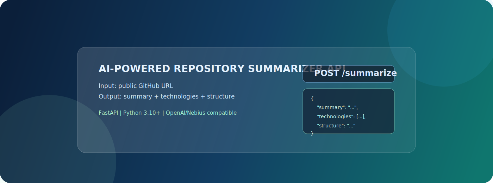
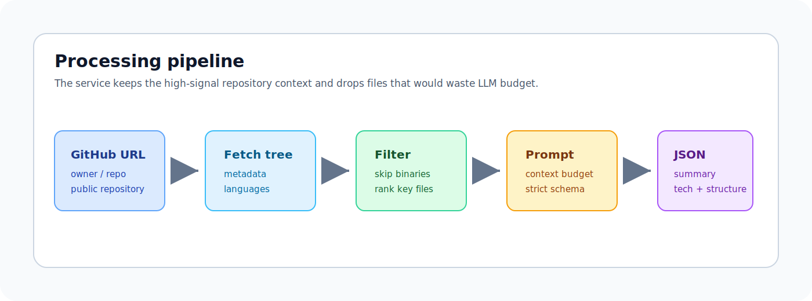
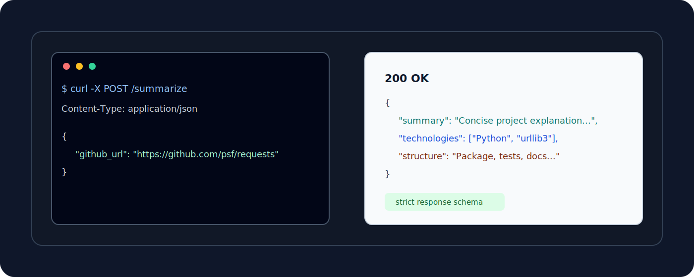
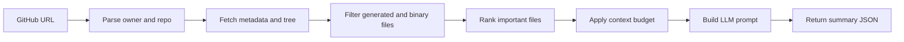

# AI-Powered Repository Summarizer API

<p align="center">
  
</p>

<p align="center">
  <a href="#"></a>
  <a href="#"></a>
  <a href="#"></a>
  <a href="#"></a>
</p>

AI-Powered Repository Summarizer API turns a public GitHub repository URL into a concise project summary. It fetches repository metadata and selected source files, filters noisy content, fits the useful context into an LLM prompt, and returns structured JSON.

| What you send | What you get |
|---|---|
| Public GitHub repository URL | Human-readable summary |
| `POST /summarize` JSON payload | Main technologies |
| Optional GitHub token for higher rate limits | Brief project structure explanation |

<p align="center">
  
</p>

## Contents

- [Quickstart](#quickstart)
- [Configuration](#configuration)
- [API Contract](#api-contract)
- [How It Works](#how-it-works)
- [Project Structure](#project-structure)
- [Operational Notes](#operational-notes)

## Quickstart

Run the full project setup and server startup:

```bash
./run_project.sh
```

The script checks for Python 3.10+, creates `.venv`, installs dependencies from `requirements.txt`, creates `.env` from `env.template` if needed, and starts the API on port `8000`.

Use another port when `8000` is already busy:

```bash
./run_project.sh --port 8001
```

The health check should return `{"status":"ok"}`:

```bash
curl http://localhost:8000/health
```

### Manual Setup

```bash
python3 -m venv .venv
source .venv/bin/activate
pip install -r requirements.txt
cp env.template .env
uvicorn app.main:app --host 0.0.0.0 --port 8000
```

Before calling `/summarize`, set at least one LLM provider key in `.env`. For repeated local tests, set `GITHUB_TOKEN` as well to avoid GitHub's low unauthenticated API limit.

## Configuration

| Variable | Required | Purpose |
|---|---:|---|
| `NEBIUS_API_KEY` | One LLM key required | Nebius Token Factory API key. |
| `OPENAI_API_KEY` | One LLM key required | OpenAI API key when using OpenAI as the alternative provider. |
| `NEBIUS_MODEL` | No | Nebius model override. Defaults to `meta-llama/Llama-3.3-70B-Instruct`. |
| `NEBIUS_BASE_URL` | No | Nebius OpenAI-compatible base URL. Defaults to `https://api.tokenfactory.nebius.com/v1/`. |
| `OPENAI_MODEL` | No | OpenAI model override. Defaults to `gpt-4o-mini`. |
| `OPENAI_BASE_URL` | No | Custom OpenAI-compatible endpoint. |
| `GITHUB_TOKEN` | No | Raises GitHub API rate limits for repository fetching. |
| `LOG_DIR` | No | Log directory. Defaults to `logs`. |
| `LLM_TIMEOUT_SECONDS` | No | LLM request timeout. |
| `LLM_MAX_RETRIES` | No | Number of LLM retry attempts. |
| `GITHUB_MAX_RETRIES` | No | Number of GitHub retry attempts. |
| `GITHUB_RETRY_BACKOFF_SECONDS` | No | Backoff delay between GitHub retry attempts. |

Example `.env` values:

```bash
NEBIUS_API_KEY=your_nebius_api_key
# OPENAI_API_KEY=your_openai_api_key
GITHUB_TOKEN=your_github_token
```

## API Contract

### `POST /summarize`

```bash
curl -X POST http://localhost:8000/summarize \
  -H "Content-Type: application/json" \
  -d '{"github_url":"https://github.com/psf/requests"}'
```

Request body:

```json
{
  "github_url": "https://github.com/psf/requests"
}
```

Successful response:

```json
{
  "summary": "Requests is a Python HTTP library...",
  "technologies": ["Python", "urllib3", "certifi"],
  "structure": "The project is organized around the main package, tests, documentation, and packaging metadata."
}
```

Error response:

```json
{
  "status": "error",
  "message": "Description of what went wrong"
}
```

<p align="center">
  
</p>

## How It Works



The repository processor prioritizes files that usually explain intent and architecture, including `README*`, dependency files, config files, docs, and top-level source directories. It skips noisy or heavy paths such as `node_modules/`, `dist/`, `build/`, virtual environments, lock files, and binary assets.

Context is bounded with hard limits on the number of files, total characters, and per-file characters. Long files are truncated before sending the prompt, which keeps the service predictable on large repositories.

The LLM call uses a system/user chat format compatible with `meta-llama/Llama-3.3-70B-Instruct`. Repository metadata and file excerpts are treated as untrusted reference material, so instructions found inside repository files are ignored. The prompt asks for one strict JSON object, and the request also sets `response_format={"type": "json_object"}` when calling the provider.

## Model Choice

Nebius Token Factory is supported through the OpenAI-compatible client. The default Nebius model is `meta-llama/Llama-3.3-70B-Instruct`. OpenAI is also supported as an alternative provider, where the default model is `gpt-4o-mini`.

## Project Structure

```text
.
├── app
│   ├── main.py                     # FastAPI app, routes, middleware wiring
│   ├── config.py                   # Configuration constants
│   ├── schemas.py                  # Request/response schemas and RepoRef dataclass
│   ├── logging_setup.py            # Rotating file logger
│   ├── error_handlers.py           # JSON error responses
│   └── services
│       ├── __init__.py
│       ├── repository_service.py   # GitHub fetching, filtering, context building
│       └── llm_service.py          # LLM prompt, retry, response parsing
├── assets
│   └── readme
│       ├── hero.svg
│       ├── workflow.svg
│       └── response-preview.svg
├── requirements.txt
├── run_project.sh
├── README.md
├── TASK.md
├── env.template
└── .gitignore
```

## Operational Notes

- Only public GitHub repositories are supported.
- A missing LLM API key returns a clear server error before provider calls are attempted.
- GitHub `403` responses are treated as rate-limit errors and returned as `429`; use `GITHUB_TOKEN` for repeated tests.
- If no suitable text files are found, the API returns `422`.
- LLM output is validated as JSON before the API response is returned.
- Runtime logs are written to `logs/app.log`, which is ignored by Git.
- `.env` is ignored by Git; keep real provider keys out of committed files.

## Development Checks

```bash
python -m compileall app
curl http://localhost:8000/health
```
